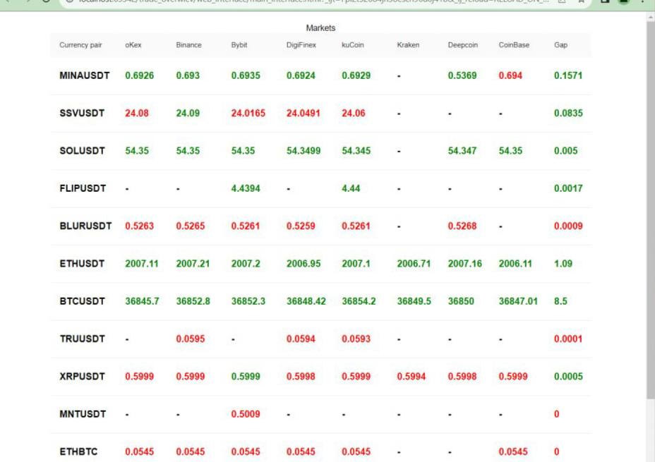
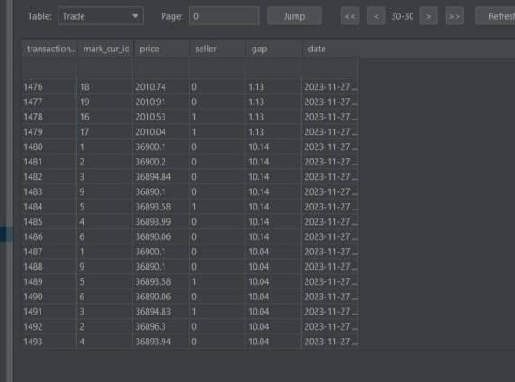
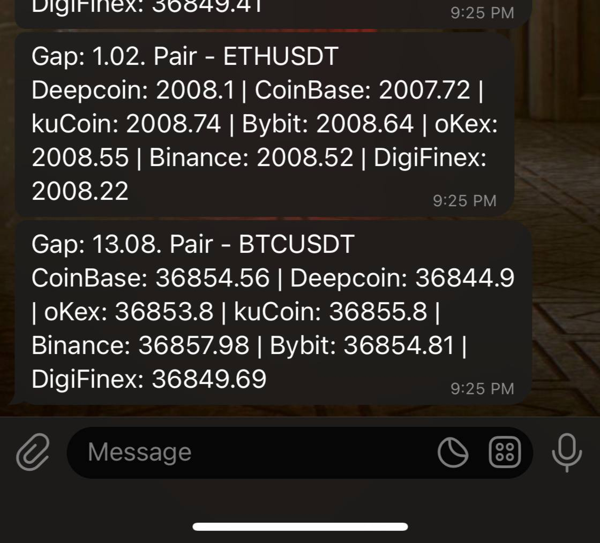

# Cryptocurrency tracker

Real time tracker of cryptocurrency prices between different markets with telegram notifications, database writer and web interface. 

## Features:
1. Easy addition of new markets 
2. Easy addition of new cryptocurrency
3. Web interface
4. Telegram notifications
5. Custom notification functions
6. Database writer

For now tracker is connected to 8 different markets 'Binance', 'Bybit', 'kuCoin', 'Kraken', 'Deepcoin', 'DigiFinex', 'CoinBase', 
'oKex' using WebSocket to obtain market data on different currency pairs on each market.

## Adding price gap
1. Replace the value of the PRICE_GAP in data.py with a new one. Default to 5.

## Adding new cryptocurrency pairs
1. Add cryptocurrency pairs in data.py in the following format: 'BTC_USDT', 'ETH_USDT'
2. Now these pairs are tracked if they are available on the markets


## Adding  new market 
 1. Add market to the date.py file
 2. Add function to request data through web sockets. 
    1. Messages transmitted via socket can be given in a dict format or a list.
    2. Market name in decorator should be the same as in data.py file
    3. Usage example:
 
```python
@market_registrator.on('Binance') 
def binance_handler(name):
    currency = currency_pairs.copy()
    currency = [''.join(pair.split('_')).lower() for pair in currency] 
    uri = 'wss://stream.binance.com/stream'
    params = [f'{val}@trade' for val in currency]
    mes = {'method': 'SUBSCRIBE',  'id': 2, 'params': [*params]}  # subscribe to trades
    return Market(name, uri, mes)
```
 3. Add function to process responses from markets
    1. Market name in decorator should be the same as in data.py file 
    2. It should return data in the following format {name:  name, price:  price, seller: seller, pair: pair}
    3. Usage example: 
```python
@request.add('Binance')
def binance(res) -> dict|None:
    js = json.loads(res)
    if js.get('stream', '1').endswith ('trade'): 
        seller = True if js['data']['m'] is True else False
        return {'name': 'Binance', 'price': js['data']['p'], 'seller': seller, 'pair': js['data']['s']}
    return None
```
4. Now  you can use the registered market as in the example folder
5. The examples/run.py shows an example of using the program
   1. notification func - any function that accepts parameters in the following format: param1:list = [{name: '', price: '', seller: '', pair: ''}, ...] param2: float = price gap 
   2. web - True or False - to activate web interface 
   3. tg_notification - True or False - to receive notification in Telegram, when price gap is more than the gap 
   4. database_writer - True or False - to write data in database, when price gap is more than the gap. By default, data is saved in the sql\test.db.
   5. gap - price gap - when price gap between currency pairs on different markets is more than the value of the gap 
  - notifications in telegram and in notification function are send and the data is written to the database

### Telegram notifications
1. Add the bot token to the utils/tg_const.py
2. Set tg_notification to True

#### Screenshots
Web interface: 

Database: 

Telegram notifications: 


#### Questions
Any questions feel free to ask

